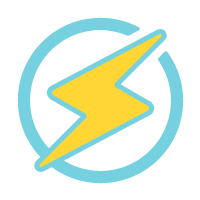

    

<h1 align="center">Hi 👋, I'm Salim Zaidi</h1>
<h2 align="center">Computer Science student passionate about System Administration, Web Development and Low-Level Programming</h2>

- 🚀 All of my projects are available at my [Github](https://github.com/zedsalim)

- ✉️ Contact me at **zedsalim@proton.me**

- 💀 I told my computer a joke, but it didn't laugh. It said **Segmentation Fault**

<h2 align="left">Interests:</h2>

- 🖥️ Configuring and maintaining servers & Home-Labs
- 🌐 Web Development
- 🐧 Linux & Sysadmin stuff
- 🖧 Networking & Cloud
- 🐳 Docker & Kubernetes
- 🔧 Automation using Bash & Python
- 💣 Binary Exploitation & Reverse Engineering
- 💡 Problem Solving
- 🎨 Design

<h2 align="left">Web Projects:</h2>
 <ul>
        <li><a href="https://garandatech.com" target="_blank">Garanda Tech</a> - An online gaming store specializing in PC parts, accessories, and repair services.</li>
        <li><a href="https://shoealgeria.com" target="_blank">Shoe Algeria</a> - E-commerce platform dedicated to footwear, offering a wide range of shoes for all occasions.</li>
        <li><a href="https://csbouira.netlify.app" target="_blank">CS Bouira</a> - Educational platform providing courses, exams, and PDF resources for students at my university.</li>
    </ul>

<h2 align="left">Languages and Tools:</h2>

<h2 align="left">Github Stats:</h2>

 
 

