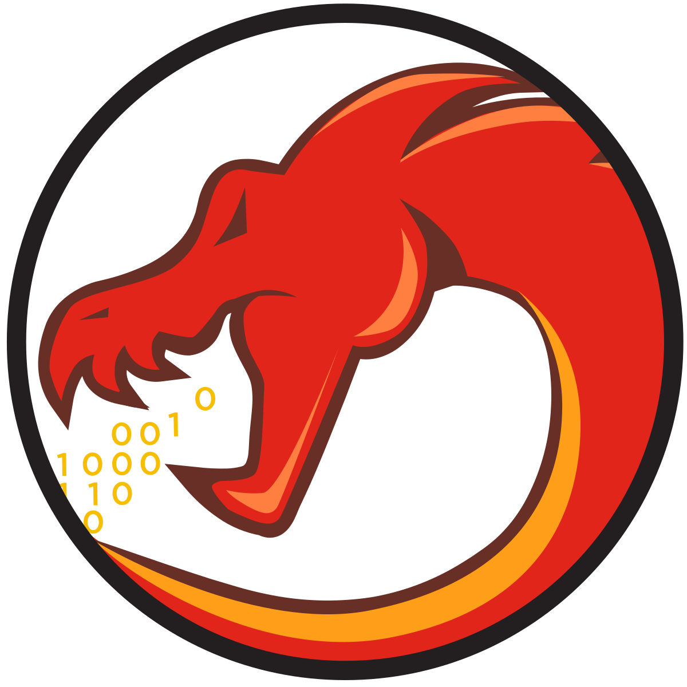

<h1 align="center">Hi 👋, I'm Salim Zaidi</h1>
<h3 align="center">Computer Science student passionate about Binary Exploitation, Reverse Engineering and Low-Level Programming.</h3>

- 📚 I’m currently learning **Binary Exploitation and Reverse Engineering**

- 🚀 All of my projects are available at [zedsalim](https://github.com/zedsalim)

- ✉️ Contact me at **salim.zaidi@univ-bouira.dz**

- 💀 I told my computer a joke, but it didn't laugh. It said **Segmentation Fault**

<h2 align="left">Interests:</h2>
<ul>
  <li> 💣 Binary Exploitation & Reverse Engineering</li>
  <li> 🖥️ Configuring and maintaining servers & Home-Labs</li>
  <li> 🐧 Linux & Sysadmin stuff</li>
  <li> 🖧 Networking & Cloud</li>
  <li> 💡 C Programming & Problem Solving</li>
  <li> 🔧 Automation using Bash & Python</li>
  <li> 🐳 Docker Containers</li>
  <li> 🕵️ Playing CTFs</li>
  <li> 🌐 Web Development</li>
</ul>

<h2 align="left">Languages and Tools:</h2>

 
  
  
  
   
  
   
  
  
  
  
  
   
  
  
  
  
   
   
   
  
  
  

<h2 align="left">Github Stats:</h2>

  
   
  
   
  

